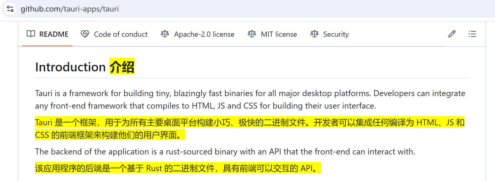
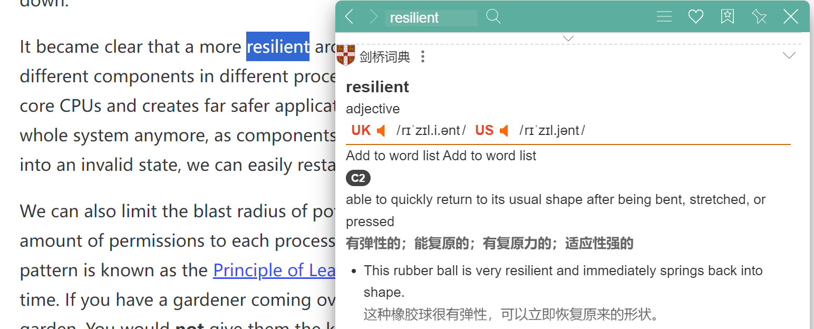
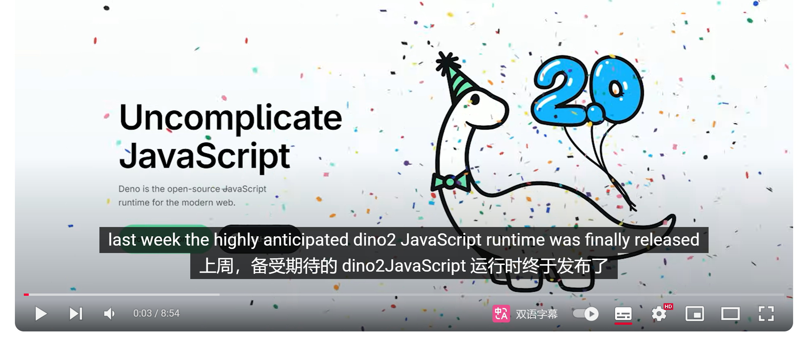
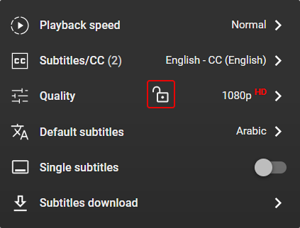

# 翻译插件推荐

---

# 桌面端/插件/APP

- \[开源\]\[桌面端\] Pot: 派了个萌的翻译器
  - <https://github.com/pot-app/pot-desktop>
- \[开过源\]\[插件/桌面端/app\] 沉浸式翻译：全网口碑炸裂的双语对照网页翻译插件
  - <https://immersivetranslate.com/zh-Hans>
  - 开源版本已归档 <https://github.com/immersive-translate/old-immersive-translate>
- \[开源\]\[插件\] 沙拉查词
  - <https://github.com/crimx/ext-saladict>

---

# 场景 1: 网站翻译

- 沉浸式翻译 提供了 双语对照翻译

> 翻译字体效果可以修改
> 作者播客 <https://www.xiaoyuzhoufm.com/episode/66b59c3d33591c27bed1fa0d>

---

# 场景 2: 微信图片/腾讯会议链接

- POT 提供了 OCR 功能

---

# 场景 3: 学单词

- 沙拉查词支持 音标，发音，常见词典

---

# 场景 4：Youtube 视频翻译

沉浸式翻译，等等

---

# 场景 5: Youtube 双语字幕下载

- <https://www.dual-subtitles.com/>

---

# 其他翻译插件软件

- [不开源] Youtube Dual Subtitles
  - <https://www.dual-subtitles.com/>
- [不开源] 划词翻译：一站式划词 / 截图 / 网页全文 / 音视频 AI 翻译
  - <https://github.com/hcfyapp/crx-selection-translate>
  - 有相关 github 仓库
  - 优点：简洁
  > 还有作者鸽了的《从零开始开发一个划词翻译扩展程序》系列文章 <https://github.com/hcfyapp/how-to-build-hcfy>
- [不开源] 彩云小译：双语对照网页翻译插件
  - <https://fanyi.caiyunapp.com/>
  - 双语翻译，但是已收费

---

# 未来前瞻

- 查拉查词未来可能无法再 chrome 浏览器使用
  > Chrome V3 闹的 drama 让我觉得浏览器扩展不太靠谱，所以在开发着客户端版本，尽量让浏览器扩展端轻量化，避免被浏览器牵着鼻子走。

- 手机浏览器翻译插件

  手机 firefox 浏览器也支持安装插件
  > edge canary 安卓版已经支持扩展了，内置了“沉浸式翻译”这个扩展。

---

# 补充列表

> 注意附上理由

- demo

---

# End

Thank you
