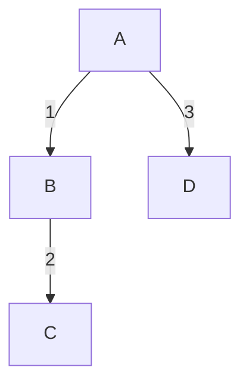

# 从零开始自制编程语言（一）

不论从哪个角度接触计算机科学，都逃不开 **编程语言** 这四个字。

就算用 Dreamweaver 这样图形化的软件来做网页，最后的结果也是一坨 HTML 代码。在初学者对多达几千种的编程语言眼花缭乱时，老手同样也会在 C++、Rust 等现代编程语言复杂的特性中不知所措，有些人甚至把自制一门编程语言当成了新时代程序员的 *时尚单品*。

那么你能自制一门语言吗？当然可以。

这正是本系列的目的：作为计算机科学大厦基石的编程语言，到底是个什么东西？

作为初学者，你可能已经在学习C语言或其它语言。你可能清楚如何在屏幕上显示“你好世界”，但却知其然不知其所以然，那你就是本系列最合适的听众，在最后的最后的最后，你可以编一个以自己名字命名的编程语言。

作为老手，你也许对自制语言不屑一顾，觉得这是在造重复轮子；也许对自制语言非常狂热，认为这很酷。但不论如何，我会深入浅出地讲解如何自制语言。如果你没有尝试过自制编程语言，这个系列就可能有点用处。

*不过如果你已经像我一样写过不少玩具语言，那这个系列不是给你听的*。

## 语言与机器

在开始当造物主之前，我想请大家思考：编程顾名思义，是编写程序。

那编程语言是什么？一句话，它是你用来编写程序的工具。

你用编程语言来写一个程序，最后可以在机器上运行，它是连接你、程序与机器的桥梁。

**但我想强调，程序员、编程语言、程序、机器是完全不一样的四个事情**。

举个曾经的网络笑话，有人在日本电车上抱怨现在很挤，却被同车的日本人以为是在询问现在几点，只因为谐音。

编程也有一样的问题。

这就像是在对一个外国人说外语，你用着汉语这门“编程语言”，尝试着让只明白“程序”这门外语的“机器”，能按你想的工作。

但不巧的是，机器并不是人：和你谈话的外国人也许会在半分钟之后灵光一闪，明白你们之间产生了误会，但机器不会，因为它们不会思考。

所以设计一门好的编程语言很重要：它可以更清楚、更快捷、更顺手地表达程序员的目的，**尽量**避免程序员和机器之间的误会。

## 最简单的语言

为了更清楚地说明语言、程序、机器和你之间的关系，让我们看看最简单的机器 *Finite State Machine* ，有限状态机。

想象一台机器，它有三个灯泡 A、B、C，以及数字按钮0到9。同一时刻，三个灯泡中只有一个会亮，最开始亮着的是A。当你按下其中一个按钮，亮着的灯泡就可能会变，也可能不变。

用上面的图举例，A灯泡亮时，按1后B就会亮，按3后D就会亮。B灯泡亮时，按2后C就会亮。

其余任何时候，做任何事，亮着的灯泡都不会变。

**你可能会问：这有什么用呢**？

在这个简单的例子中，这台虚拟的机器就是“电脑”，上面亮与不亮的规则就是“程序”，给机器编写这个规则的人就是“程序员”。

“程序员”通过观察“电脑”亮着的灯泡，就可以判断按下去的按钮是否符合某种规律。不难推断，如果最后亮着的是D，那就按下过3。如果亮着的是C，那就按下过1、2。

如果这台机器的输入并不是十个按钮，而是一个又一个数字…… 那编写合适的程序，比如说上面的规则图，这台想象中的机器就能判断输入过什么模式的数字。

你编写一个模式，让电脑编译运行后接受一串文字，再告诉你它是不是符合你编写的模式……

这实际上已经耳熟能详，正是 *regular expression* 正则表达式。恭喜你已经创造了、或许该说发现了现今最强大的文本匹配语言！

这其中的区别只在于你的“编程语言”是上面那张图、是我们的口述，它规定了机器该怎么反应。而真实的正则表达式可以很明确地写出来，被编译程序，被电脑运行……

## 结语

希望这能让你对程序员、语言、程序、机器有最基本的理解。下一节我会更正规的讲解有限状态机和正则表达式。
